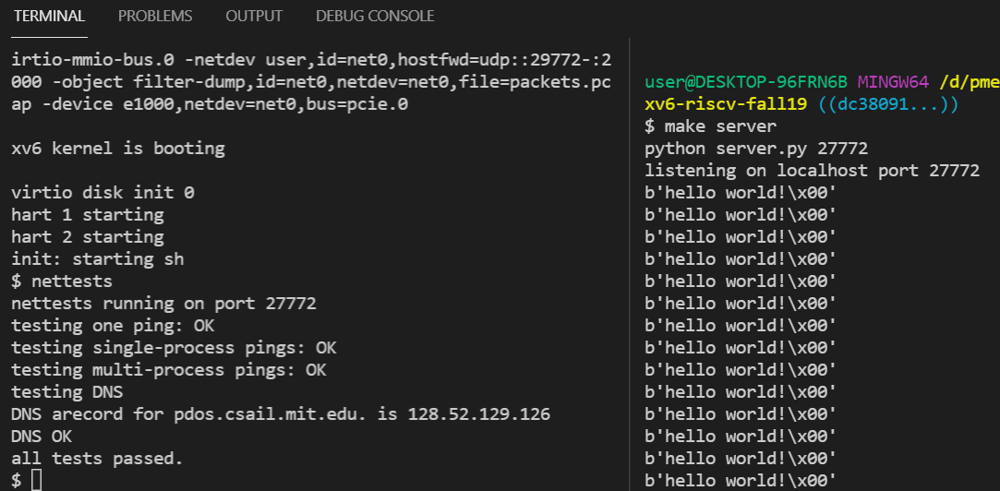

# ccc 筆記

## netRun

執行成功，如下圖：




server

```
$ make server
python server.py 27772
listening on localhost port 27772
b'hello world!\x00'
b'hello world!\x00'
b'hello world!\x00'
b'hello world!\x00'
b'hello world!\x00'
b'hello world!\x00'
b'hello world!\x00'
b'hello world!\x00'
b'hello world!\x00'
b'hello world!\x00'
```

client

```
mkfs/mkfs fs.img README user/xargstest.sh user/_cat user/_echo user/_forktest user/_grep user/_init user/_kill user/_ln user/_ls user/_mkdir user/_rm user/_sh user/_stressfs user/_usertests user/_wc user/_zombie user/_nettests user/_cowtest user/_uthread user/_call user/_testsh user/_kalloctest user/_bcachetest user/_alloctest user/_bigfile
nmeta 46 (boot, super, log blocks 30 inode blocks 13, bitmap blocks 1) blocks 1954 total 2000
balloc: first 799 blocks have been allocated
balloc: write bitmap block at sector 45
qemu-system-riscv64 -machine virt -bios none -kernel kernel/kernel -m 128M -smp 3 -nographic -drive file=fs.img,if=none,format=raw,id=x0 -device virtio-blk-device,drive=x0,bus=virtio-mmio-bus.0 -netdev user,id=net0,hostfwd=udp::29772-:2000 -object filter-dump,id=net0,netdev=net0,file=packets.pcap -device e1000,netdev=net0,bus=pcie.0

xv6 kernel is booting

virtio disk init 0
hart 1 starting
hart 2 starting
init: starting sh
$ nettests
nettests running on port 27772
testing one ping: OK
testing single-process pings: OK
testing multi-process pings: OK
testing DNS
DNS arecord for pdos.csail.mit.edu. is 128.52.129.126
DNS OK
all tests passed.
```
